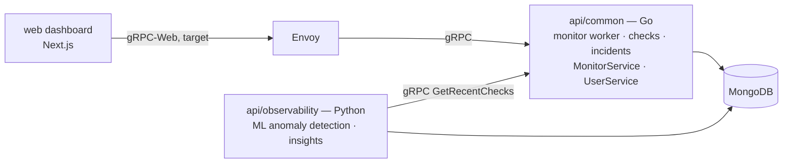

# Upstat

Open-source uptime and status monitoring — schedule health checks against your
services, record incidents, expose status pages, and surface ML-powered
reliability insights.

[](./LICENSE)
[](https://github.com/cuesoftinc/upstat/actions/workflows/build-and-test.yml)

## Overview

Upstat is a monorepo containing the clients, backend services, deployment
configuration, and documentation for the platform. A Go backend owns monitor
state and check execution, a Python service adds analytics and anomaly
detection, and a Next.js frontend serves its dashboard. gRPC-Web through an
Envoy proxy is the target control-plane path; the client is retained but not
yet wired — the shipped web app currently reads and writes dashboard data
through its in-app mock CRUD server (`/api/mock/v1`). For a deeper
description of the components and how they fit together, see
[docs/overview.md](docs/overview.md).

> **Scope note:** the diagram below is current state (uptime/status core).
> Upstat's ratified direction is a full observability platform — see
> [docs/prd.md §9](docs/prd.md) and [docs/decisions.md](docs/decisions.md).

## Architecture



- **Target control plane:** the browser speaks **gRPC-Web**; **Envoy**
  translates it to native **gRPC** for the Go backend and applies CORS. This
  client is retained (`web/src/components/libs/grpc`) but not yet wired — the
  shipped web app currently serves dashboard data from its in-app mock CRUD
  server (`/api/mock/v1`) instead.
- The **observability** service is a gRPC client of the Go backend: it pulls
  recent checks, runs anomaly detection / insight generation, and persists the
  results.

### Tech stack

| Layer          | Technology                                             |
| -------------- | ------------------------------------------------------ |
| Backend API    | Go 1.26, gRPC, MongoDB (`api/common`)                  |
| Observability  | Python, FastAPI, scikit-learn, gRPC (`api/observability`) |
| Web            | Next.js, React, TypeScript; mock CRUD server (current data path), gRPC-Web control plane (target, unwired) |
| Proxy          | Envoy (gRPC-Web → gRPC, target control plane)           |
| Mobile         | Flutter (placeholder)                                  |
| Infrastructure | Docker, Helm, Terraform                                |

## Repository structure

```
api/
  common/          Go service — gRPC backend: monitors, checks, incidents, users
  observability/   Python service — reliability analytics, ML anomaly detection, insights
web/               Next.js dashboard + status pages (mock CRUD server; gRPC-Web client retained for the target control plane)
mobile/
  flutter/         Flutter app (placeholder)
  android/         Native Android (placeholder)
  ios/             Native iOS (placeholder)
deploy/
  docker/          Placeholder — the compose stack lives at the repo root (docker-compose.yml)
  helm/            Helm chart (deploys all services, including Envoy, to Kubernetes)
  terraform/       Infrastructure as code
docker-compose.yml Local orchestration: mongo, api-common, api-observability, envoy, web
docs/              Project documentation
scripts/           Developer and CI helper scripts
```

Additional services follow the same convention: `api/common` is the shared Go
backend, and every other service lives under `api/<service-name>` named by its
function (never by its language).

## Getting started

### Prerequisites

- [Docker](https://www.docker.com/) & Docker Compose (recommended path)
- For native development: [Go](https://go.dev/) 1.26+, [Node.js](https://nodejs.org/)
  24 (`web/.nvmrc`), Python 3.11+, and Envoy (only needed for the target
  gRPC-Web control plane, not for the web app to function)

### Quick start

```bash
cp .env.example .env
make up      # build + start mongo, api-common (:8080), api-observability (:8081), envoy (:8082), web (:3000)
make logs    # follow logs
make down    # stop
```

Configuration is provided at runtime via environment variables (for example
`MONGO_URI`, `JWT_SECRET`, `GOOGLE_CLIENT_ID`, and the inter-service gRPC auth
token). See [docs/setup.md](docs/setup.md) for details; `make help` lists all
targets. Never commit credentials or bake them into an image.

## Documentation
- [Hosted docs](https://cuesoft.gitbook.io/upstat) — the full documentation site (auto-synced from `docs/`)

- [Project overview](docs/overview.md) — architecture and components
- [Local setup](docs/setup.md) — development environment and per-service run commands

## Contributing

Contributions are welcome. Please read the [Contributing guide](CONTRIBUTING.md)
and our [Code of Conduct](CODE_OF_CONDUCT.md) before opening a PR.

## Security

Please report vulnerabilities privately — see our [Security policy](SECURITY.md).

## License

See [LICENSE](LICENSE).
