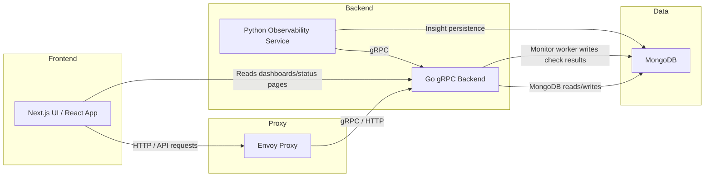
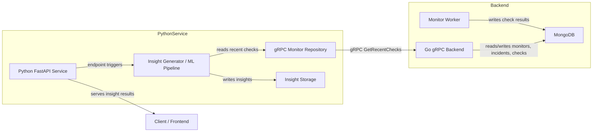
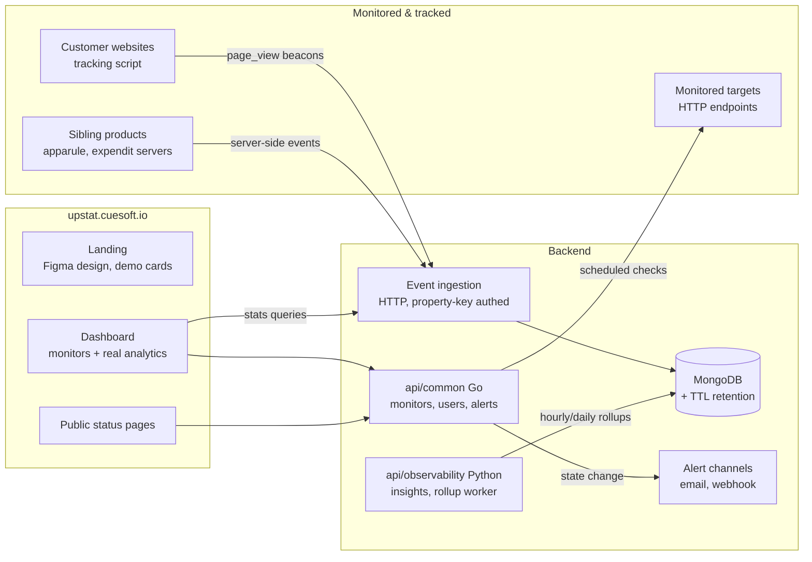
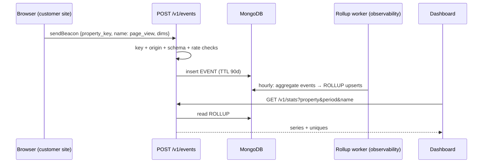
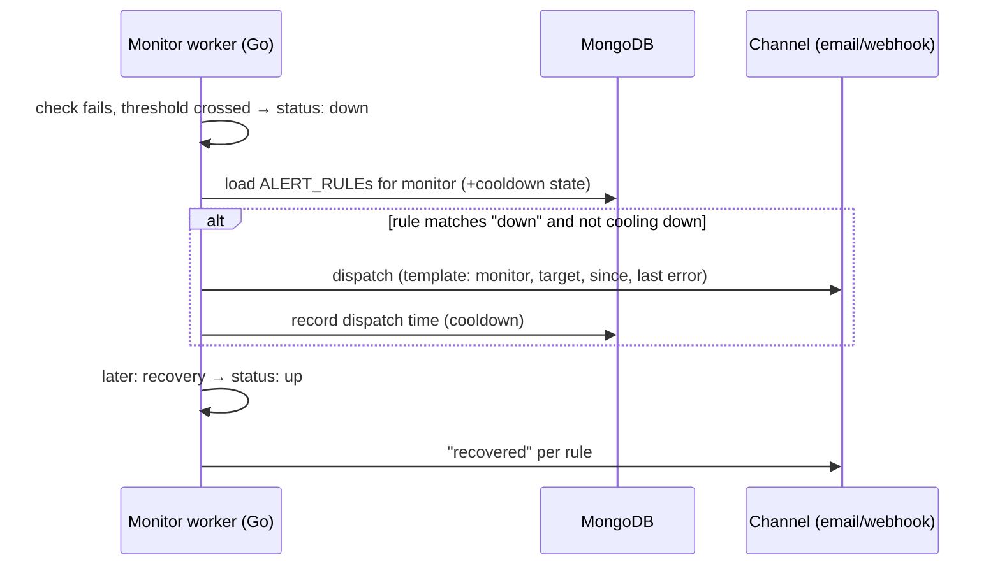
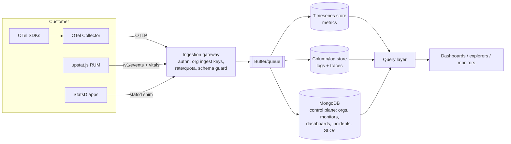

# Upstat Architecture

## Overview
This diagram describes the main components of Upstat and how they interact.

## Components

- **Frontend**: Next.js / React application in `web`.
- **Envoy**: Proxy layer in `deploy/helm/envoy/envoy.yaml` and Docker Compose.
- **Go Backend**: gRPC server in `api/common`, exposing `MonitorService` and `UserService`.
- **Python Observability Service**: FastAPI service in `api/observability`, calling Go backend via gRPC to analyze recent monitor checks.
- **MongoDB**: Primary database for monitors, check results, incidents, and insights.

## Communication patterns

- `UI -> Envoy -> GoBackend`: frontend requests route through Envoy.
- `PythonService -> GoBackend`: gRPC client calls using shared proto definitions in `api/common/internal/proto/user.proto`.
- `GoBackend -> Mongo`: persistence for monitors, checks, incidents.
- `PythonService -> Mongo`: insight persistence.

## Notes

- The system is distributed: services run in separate containers/processes and communicate over network protocols.
- The project currently uses Docker Compose for local orchestration.
- The Go backend contains an internal monitor worker that schedules periodic checks.

## Backend + Python Observability Service Details

### Go backend 

1. The Go service starts in `api/common/cmd/server/main.go`, initializing the MongoDB connection and registering the gRPC `MonitorService` and `UserService` handlers.
2. The gRPC API is defined in `api/common/internal/proto/user.proto` and includes `GetRecentChecks`, `GetStatusPage`, and monitor CRUD operations.
3. The internal monitor worker in `api/common/internal/service/monitor_worker_service.go` wakes periodically, loads active monitors, and executes checks concurrently.
4. Check execution is done in `api/common/internal/service/checker_service.go`, which performs the HTTP request, measures response time, and assembles a check result.
5. Check results are persisted through `api/common/internal/repository/check_result_repository.go`.
6. Incidents and monitor state are updated through the corresponding repository methods in `api/common/internal/repository/incident_repository.go` and `api/common/internal/repository/monitor_repository.go`.

### Python observability service 

1. The Python service starts in `api/observability/app/main.py` and loads env vars from `api/observability/.env`.
2. Its FastAPI routes are defined in `api/observability/router/insights.py` and `api/observability/router/analyze.py`.
3. `GET /insights/{monitor_id}` and `POST /analyze/{monitor_id}` both call `generate_insight(monitor_id)` in `api/observability/service/insight_generator.py`.
4. That generator calls `api/observability/repository/monitor_repository.py`, which opens a gRPC connection to the Go backend and calls `GetRecentChecks`.
5. The gRPC response is converted into local `MonitorCheck` objects.
6. Feature extraction is performed by `api/observability/ml/feature_builder.py`, producing metrics such as failed checks, total checks, and average response time.
7. Risk scoring and anomaly classification are performed by `api/observability/service/risk_scorer.py`, `service/severity_classifier.py`, and `service/ml_anomaly_detector.py`.
8. Human-readable signals are generated by `api/observability/analysis/failure_analysis.py`, `latency_analysis.py`, and `trend_analysis.py`.
9. The final `Insight` object is saved through `api/observability/repository/insight_repository.py` and returned to the caller.

### Why this is useful

- The Go backend owns monitor state and check execution, making it the authoritative source for recent monitor health.
- The Python service owns analytics and machine learning, consuming the Go service via a clear gRPC interface.
- The system separates operational monitoring from analysis, which is the key architectural boundary.

---

# Target architecture (PRD phase)

> Everything above documents the system as it exists. This section adds the
> PRD-driven target design. Markers: **[PRD]** = stated requirement,
> **[Proposed]** = design decision for ratification. See [prd.md](prd.md) for
> the requirement register (M1 monitoring / M2 analytics / M3 ecosystem
> tracking).

## Target context

## The events layer (M2 + M3) **[Proposed]**

This is the design for what sibling roadmaps call **dependency D2** — Upstat
as the ecosystem's standardized event tracker **[PRD §4.2]**.

- **Ingestion**: `POST /v1/events` — plain HTTP/JSON (browser `sendBeacon`
  compatible), authenticated by a *write-only property key* + origin
  allowlist + rate limiting. Payloads validate against a closed schema
  (name + coarse dims only) so sensitive data is rejected structurally
  (data-model.md §2).
- **Tracking script**: `upstat.js` — a few KB, cookieless; auto page-views on
  history changes + `upstat("event", "demo_start")` for custom events.
- **Aggregation**: the observability service gains a rollup worker (hour/day
  buckets, approximate uniques via the daily-rotating `visitor_hash`).
  Dashboards and the stats API read rollups, never raw events.
- **Dashboards**: the existing traffic page moves from mock
  `/api/dashboard/*` routes onto `GET /v1/stats` (ANA-002); bounce/SEO/
  page-load pages follow only where honest data exists (prd.md §4).

## Alerting (MON-001) **[Proposed]**

The monitor worker already tracks `consecutiveFailures` vs `failureThreshold`
and flips `status` — alerting hooks that transition:

Email provider is an open decision (prd.md §8.2); webhooks are
provider-independent and may ship first if the email decision stalls.

## Non-goals guardrail

Per PRD §5, the target explicitly excludes APM/tracing/log aggregation and
session replay. Any feature request in those directions re-opens the PRD
rather than growing scope silently.

---

# Observability platform expansion (2026-07-16) **[Directive]**

> Supersedes the "Non-goals guardrail" above and the PRD §5 restraint: Upstat
> now targets a **full observability & SRE platform** (Datadog-class) —
> pillars in [pages.md](pages.md). The events layer and alerting designed
> above stand unchanged; they become the RUM pillar's foundation and the
> monitor engine respectively.

## Ingestion architecture **[Proposed]**

**OpenTelemetry-native**: OTLP (gRPC + HTTP) is the single first-party intake
for traces, metrics, and logs — customers use standard OTel SDKs/collectors,
no proprietary agent to build or maintain. Complements: the existing HTTP
events API + `upstat.js` (RUM), StatsD-compat shim (metrics), uptime checker
(synthetics).

## The storage decision (gating, R2)

MongoDB cannot serve high-cardinality timeseries or log search at platform
scale. **Proposal: ClickHouse as the unified telemetry store** (metrics,
logs, traces in columnar tables — the Signoz/HyperDX-proven pattern), with
MongoDB retained solely as the control plane. Alternative split
(VictoriaMetrics + OpenSearch) rejected for operational surface. Self-host
compose gains one ClickHouse container; helm adds a StatefulSet or external
endpoint — mirrors the existing "chart deploys no DB" stance. **[Ratify
before OBS-001 implementation.]**

## Query layer

One internal query service translating the shared QueryBar grammar
(design.md §3) to store-specific queries; all pillars and the monitor
evaluator consume it — monitors are "saved queries + thresholds on a
schedule", nothing pillar-specific.

## Honesty stance for the build-out

Pillars ship behind org-level feature flags; a pillar is not "available"
until its explorer, retention, and monitor support all work. Marketing may
list pillars as "early access" but the in-app empty states (MI-16) never
pretend data exists. Sequencing in roadmap.md revision.
