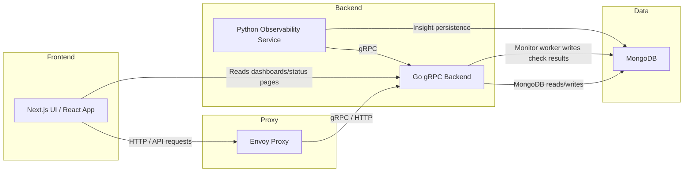
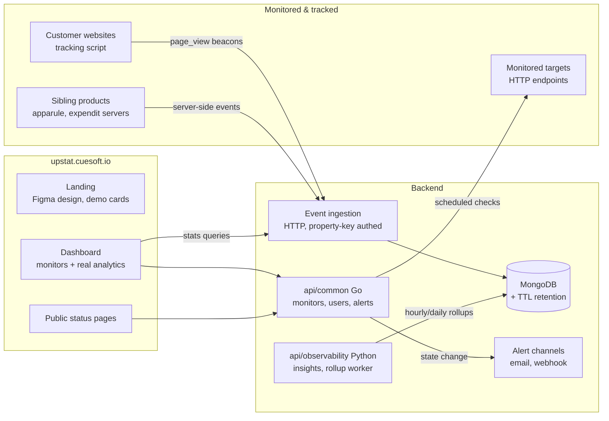
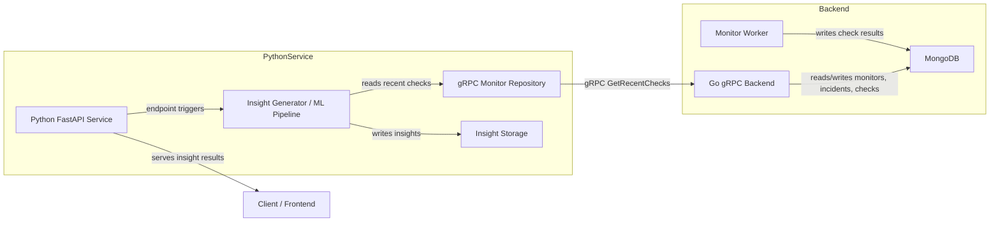
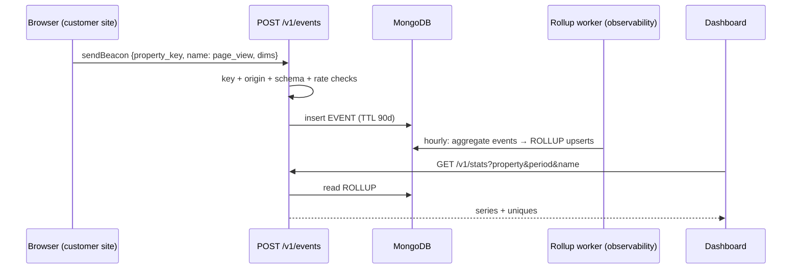
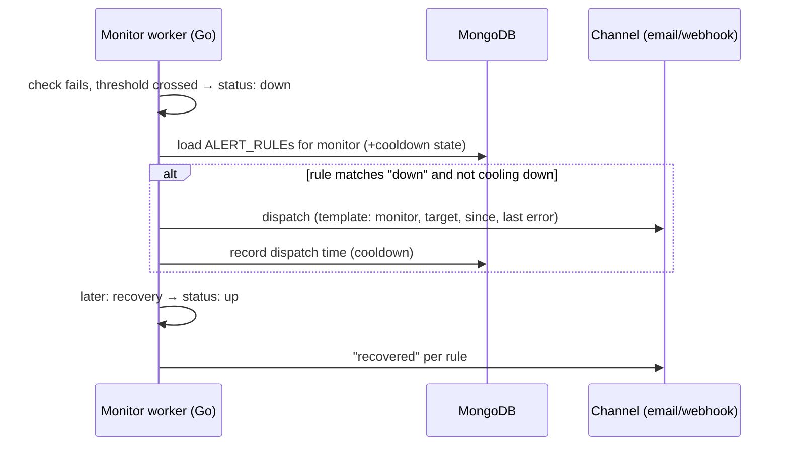
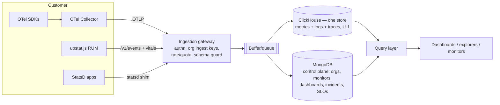

# Upstat — System Architecture

> Canonical structure (ecosystem standard): current state → target state →
> service breakdown → deep dives → deployment → dependencies. All content
> preserved from the organic original; decisions.md governs where markers
> lag. Markers: **[Current]**, **[PRD]**, **[Directive]**, **[Decided]**.

## 1. Context — current state **[Current]**

This diagram describes the main components of Upstat and how they interact.

### 1.1 Components

- **Frontend**: Next.js / React application in `web`.
- **Envoy**: Proxy layer in `deploy/helm/envoy/envoy.yaml` and Docker Compose.
- **Go Backend**: gRPC server in `api/common`, exposing `MonitorService` and `UserService`.
- **Python Observability Service**: FastAPI service in `api/observability`, calling Go backend via gRPC to analyze recent monitor checks.
- **MongoDB**: Primary database for monitors, check results, incidents, and insights.

### 1.2 Communication patterns

- `UI -> Envoy -> GoBackend`: frontend requests route through Envoy.
- `PythonService -> GoBackend`: gRPC client calls using shared proto definitions in `api/common/internal/proto/user.proto`.
- `GoBackend -> Mongo`: persistence for monitors, checks, incidents.
- `PythonService -> Mongo`: insight persistence.

### 1.3 Notes

- The system is distributed: services run in separate containers/processes and communicate over network protocols.
- The project currently uses Docker Compose for local orchestration.
- The Go backend contains an internal monitor worker that schedules periodic checks.

## 2. Context — target state **[Decided]**

## 3. Service breakdown — backend + observability internals **[Current]**

## 4. The events layer (M2 + M3) **[Decided]**

This is the design for what sibling roadmaps call **dependency D2** — Upstat
as the ecosystem's standardized event tracker **[PRD §4.2]**.

- **Ingestion**: `POST /v1/events` — plain HTTP/JSON (browser `sendBeacon`
  compatible), authenticated by a *write-only property key* + origin
  allowlist + rate limiting. Payloads validate against a closed schema
  (name + coarse dims only) so sensitive data is rejected structurally
  (data-model.md §2).
- **Tracking script**: `upstat.js` — a few KB, cookieless; auto page-views on
  history changes + `upstat("event", "demo_start")` for custom events.
- **Aggregation**: the observability service gains a rollup worker (hour/day
  buckets, approximate uniques via the daily-rotating `visitor_hash`).
  Dashboards and the stats API read rollups, never raw events.
- **Dashboards**: the B6 RUM pillar reads `GET /v1/stats` rollups
  (ANA-002); bounce/SEO/page-load views ship only where honest data
  exists (prd.md §4).

## 5. Alerting (MON-001) **[Decided]**

The monitor worker already tracks `consecutiveFailures` vs `failureThreshold`
and flips `status` — alerting hooks that transition:

Email provider is an open decision (prd.md §8.2); webhooks are
provider-independent and may ship first if the email decision stalls.

## 6. Observability platform expansion (2026-07-16) **[Directive]**

> Supersedes the earlier "lightweight" guardrail (kept below for audit).

### 6.1 Ingestion architecture

> **X-5 note:** every "MongoDB" box in the earlier (pre-X-5) diagrams of this
> file reads as the control-plane store — now **Aiven Postgres**; Phase-1
> events land in Postgres partitioned tables with a scheduled retention job
> (data-model §3), NOT Mongo TTL. Diagrams are updated as touched.

**OpenTelemetry-native**: OTLP (gRPC 4317 + HTTP 4318) is the single
first-party intake — and per **X-9** the ecosystem's: apparule and expendit
ship their traces/metrics/logs here (direct SDK export, ingest-key authed),
making the sibling products this gateway's first customers
for traces, metrics, and logs — customers use standard OTel SDKs/collectors,
no proprietary agent to build or maintain. Complements: the existing HTTP
events API + `upstat.js` (RUM), StatsD-compat shim (metrics), uptime checker
(synthetics).

### 6.2 Ingestion operations

- **Buffering**: Phase 1 (/v1/events) has **no external buffer** — direct
  Postgres inserts; overload answers `429` (never silent drop; rejected
  counters tell the truth). OBS-001 (OTLP) uses **ClickHouse async_insert**
  as the buffer with gateway backpressure → `429 quota_exceeded`; ingest SLO
  target p99 < 250ms accept latency.
- **ClickHouse ops**: single node to start (sandbox), daily backups to the
  Cloud Storage bucket, disk sized to retention (13mo metrics / 15d logs /
  7d traces), replication deferred until load demands (documented upgrade
  path: ReplicatedMergeTree + 3 keepers).
- **Tenancy isolation**: `org_id` prefixes every ORDER BY (data-model DDL);
  quotas enforced at the gateway per ingest key; per-org query concurrency
  cap 4 in the query layer (noisy-neighbor containment).

### 6.3 The storage decision (U-1, ratified)

MongoDB cannot serve high-cardinality timeseries or log search at platform
scale. **Proposal: ClickHouse as the unified telemetry store** (metrics,
logs, traces in columnar tables — the Signoz/HyperDX-proven pattern), with
MongoDB retained solely as the control plane. Alternative split
(VictoriaMetrics + OpenSearch) rejected for operational surface. Self-host
compose gains one ClickHouse container; helm adds a StatefulSet or external
endpoint — mirrors the existing "chart deploys no DB" stance. **[Ratify
before OBS-001 implementation.]**

### 6.4 Query layer

One internal query service translating the shared QueryBar grammar
(design.md §3) to store-specific queries; all pillars and the monitor
evaluator consume it — monitors are "saved queries + thresholds on a
schedule", nothing pillar-specific.

### 6.5 Honesty stance for the build-out

Pillars ship behind org-level feature flags; a pillar is not "available"
until its explorer, retention, and monitor support all work. Marketing may
list pillars as "early access" but the in-app empty states (MI-16) never
pretend data exists. Sequencing in roadmap.md revision.

### 6.6 Superseded non-goals guardrail (audit trail)

Per PRD §5, the target explicitly excludes APM/tracing/log aggregation and
session replay. Any feature request in those directions re-opens the PRD
rather than growing scope silently.

---

## 7. Deployment view

Cloud: [deployment.md](deployment.md) (Cloud Run via cuesoft-iac, X-3/X-6 —
api/common `min-instances: 1` + scheduler lease). Self-host: compose
(mongo/redis/envoy + services) and the standard-form Helm chart + terraform
in `deploy/` — validated end-to-end on a live cluster.

## 8. Cross-repo dependencies

| ID | Dependency | Direction | Notes |
| --- | --- | --- | --- |
| D2 | Event-ingestion API | **provided by this repo** (Phase 1) | unblocks apparule/expendit analytics |
| D1 | `account.cuesoft.io` facade | consumed, later | X-1: Firebase interim ratified — not blocking |
| D3 | Upstat clause on privacy.cuesoft.io | consumed | UPS-005 copy |
| X-5/X-7 | Aiven PG + Redis, Brevo | consumed | shared data/email plane |
