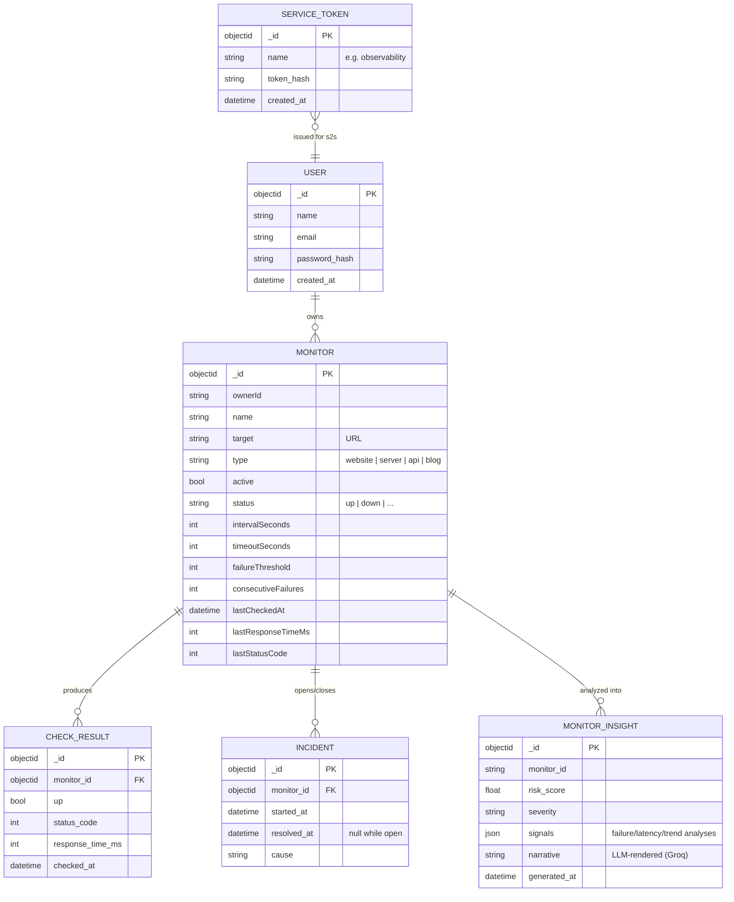
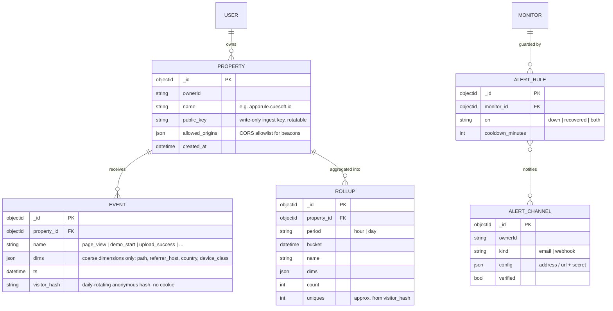

# Upstat — Data Model

> Companion to [prd.md](prd.md) / [architecture.md](architecture.md).
> Markers: **[Current]**, **[PRD]**, **[Proposed]**.

## 1. Current entities **[Current]** (MongoDB, database `Upstat`)

(Field lists are representative of `internal/model/*.go` + repository structs;
insight shape comes from the observability service's generator.)

## 2. Target additions **[Proposed]** — the analytics/events layer (M2/M3)

Modeling notes:

- **`EVENT.dims` is a closed, validated vocabulary** — the schema is the
  privacy boundary (prd.md §6): free-form payloads are rejected at ingest so
  sibling products *cannot* leak financial/measurement data into analytics
  even by accident.
- **`visitor_hash`**: cookieless uniques via
  `hash(daily_salt, property, ip, user_agent)`; the salt rotates daily and raw
  IPs are never stored. **[Proposed — the privacy-defining choice, ratify]**
- **Rollups are the query surface**; raw `EVENT` rows exist to rebuild rollups
  and are the first thing retention deletes.
- **Alerting is monitor-scoped** with owner-scoped reusable channels; email
  requires a provider decision (prd.md §8.2 — old SMTP plumbing was
  deliberately removed and should return via one well-chosen provider).

## 3. Storage mapping

| Concern | Choice | Rationale |
| --- | --- | --- |
| Everything current | MongoDB (`Upstat` db) **[Current]** | as-is |
| Events + rollups | MongoDB collections with TTL indexes **[Proposed]** | "lightweight architecture" (§5): no new datastore; TTL indexes give free retention enforcement; revisit only if volume demands it |
| Alert dispatch state | Mongo (rule cooldown timestamps) | avoids a queue dependency at this scale |

## 4. Retention & privacy **[Proposed defaults, to ratify + publish per UPS-003/005]**

| Data | Retention | Notes |
| --- | --- | --- |
| Raw events | 90 days (TTL) | rollups carry the history |
| Rollups (hour) | 90 days | day rollups cover longer horizons |
| Rollups (day) | 13 months | year-over-year comparisons |
| Check results | 90 days | insights summarize older history |
| Incidents | indefinite | they are the historical record |
| Visitor identifiers | never stored raw | `visitor_hash` only, daily-rotating |

| Class | Data | Rules |
| --- | --- | --- |
| Visitor data | events, visitor_hash | cookieless, anonymized, no cross-property joins; disclosed on the privacy page (UPS-005) |
| Customer data | monitors, targets, alert configs | targets may embed internal hostnames — treat as confidential |
| Operational | checks, rollups, insights | safe for internal metrics |
