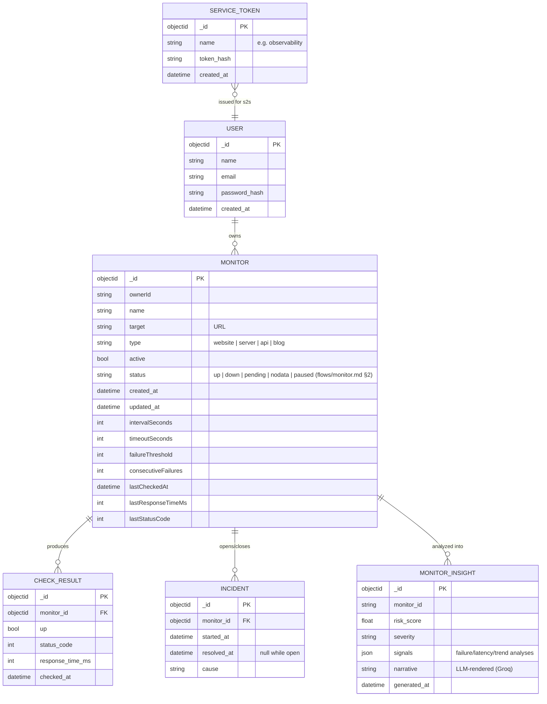
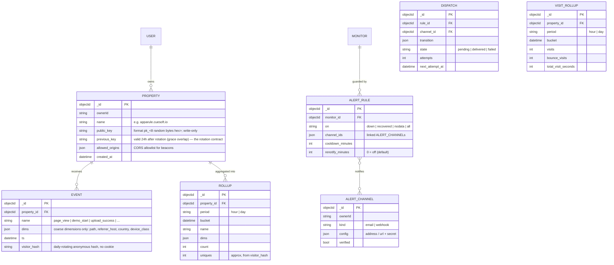
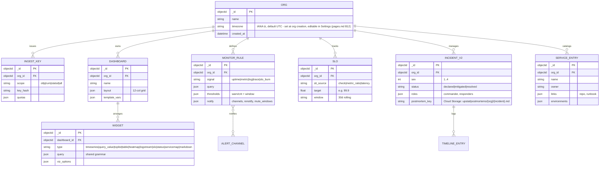

# Upstat — Data Model

> Companion to [prd.md](prd.md) / [architecture.md](architecture.md).
> Markers: **[Current]**, **[PRD]**, **[Proposed]**.

## 1. Current entities **[Current]** (MongoDB, database `Upstat`)



(Field lists are representative of `internal/model/*.go` + repository structs;
insight shape comes from the observability service's generator.)

## 2. Target additions **[Proposed]** — the analytics/events layer (M2/M3)



Modeling notes:

- **`EVENT.dims` is a closed, validated vocabulary** — the schema is the
  privacy boundary (prd.md §6): free-form payloads are rejected at ingest so
  sibling products *cannot* leak financial/measurement data into analytics
  even by accident.
- **`visitor_hash`**: cookieless uniques via
  `hash(daily_salt, property, ip, user_agent)`; the salt rotates daily and raw
  IPs are never stored. **[Proposed — the privacy-defining choice, ratify]**
- **Rollups are the query surface**; raw `EVENT` rows exist to rebuild rollups
  and are the first thing retention deletes.
- **Alerting is monitor-scoped** with owner-scoped reusable channels; email
  requires a provider decision (prd.md §8.2 — old SMTP plumbing was
  deliberately removed and should return via one well-chosen provider).

## 3. Storage mapping

| Concern | Choice | Rationale |
| --- | --- | --- |
| Everything current | MongoDB (`Upstat` db) **[Current]** | as-is until the control-plane→**Postgres** migration (X-5, with the monitors-v2/OBS work) |
| Events + rollups | Phase 1: control-plane store (**Postgres** partitioned tables + scheduled retention job, per X-5) | folds into **ClickHouse** when OBS-001 lands (U-1); the TTL-index shortcut died with the Mongo control plane |
| Alert dispatch state | control-plane store (rule cooldown timestamps) | avoids a queue dependency at this scale |

## 4. Retention & privacy **[Proposed defaults, to ratify + publish per UPS-003/005]**

| Data | Retention | Notes |
| --- | --- | --- |
| Raw events | 90 days (TTL) | rollups carry the history |
| Rollups (hour) | 90 days | day rollups cover longer horizons |
| Rollups (day) | 13 months | year-over-year comparisons |
| Check results | 90 days | insights summarize older history |
| Incidents | indefinite | they are the historical record |
| Visitor identifiers | never stored raw | `visitor_hash` only, daily-rotating |

| Class | Data | Rules |
| --- | --- | --- |
| Visitor data | events, visitor_hash | cookieless, anonymized, no cross-property joins; disclosed on the privacy page (UPS-005) |
| Customer data | monitors, targets, alert configs | targets may embed internal hostnames — treat as confidential |
| Operational | checks, rollups, insights | safe for internal metrics |

---

## 5. Observability platform entities (2026-07-16) **[Proposed]**

Control plane additions (**Aiven Postgres** per X-5; entity names keep their shapes):



Identity posture (X-10, ratified 2026-07-16 — [decisions.md](decisions.md)):
upstat is **tier 0 + tier-1-minimal** — Google identity (X-1) plus exactly
one profile field, `ORG.timezone` (IANA, default `UTC`; set at org creation,
editable in Settings, pages.md B12). It exists so report rendering and
time-bucketing *display* resolve in the org's timezone while storage and
rollups stay UTC ([analytics-math.md](analytics-math.md) §3). The `country`
in `EVENT.dims` (§2) is a coarse *event* dimension, **not** org identity —
no address or country identity field exists. Tier 2 (provider-verified
financial identity) is N/A until billing enters the PRD.

### Telemetry-plane DDL sketch (ClickHouse, U-1 — draft to finalize at OBS-001)

```sql
CREATE TABLE metrics_points (
  org_id LowCardinality(String), series_hash UInt64,
  name LowCardinality(String), tags Map(String, String),
  ts DateTime64(3), value Float64
) ENGINE = MergeTree
  PARTITION BY toYYYYMM(ts)
  ORDER BY (org_id, series_hash, ts)
  TTL toDateTime(ts) + INTERVAL 13 MONTH;

CREATE TABLE logs (
  org_id LowCardinality(String), service LowCardinality(String),
  level LowCardinality(String), ts DateTime64(3),
  message String, attrs Map(String, String), trace_id String
) ENGINE = MergeTree
  PARTITION BY toDate(ts)
  ORDER BY (org_id, service, ts)
  TTL toDateTime(ts) + INTERVAL 15 DAY;

CREATE TABLE spans (
  org_id LowCardinality(String), trace_id String, span_id String,
  parent_id String, service LowCardinality(String), name LowCardinality(String),
  start DateTime64(6), duration_ns UInt64, status UInt8,
  attrs Map(String, String)
) ENGINE = MergeTree
  PARTITION BY toDate(start)
  ORDER BY (org_id, service, start)
  TTL toDateTime(start) + INTERVAL 7 DAY;
```

`org_id` leads every ORDER BY — the tenancy-isolation primitive (queries are
always org-scoped; cross-org reads are structurally awkward by design).

Legacy sketch note (superseded by the DDL above): `metrics_points`
(series-hash, ts, value, tags), `logs` (ts, org, service, level, message,
attrs map, trace_id), `spans` (trace_id, span_id, parent, service, name,
start, duration, status, attrs) — schemas finalized during OBS-001 design.
Retention defaults extend §4's table: metrics 13mo (rollup-thinned), logs
15d hot (+archive later), traces 7d sampled **[Proposed]**.
