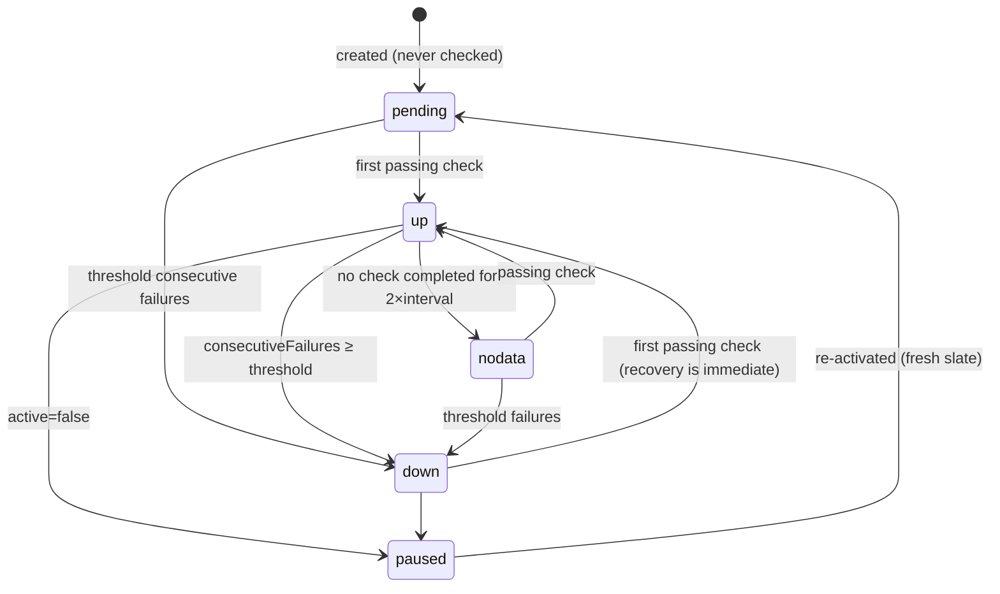

# Flow: Uptime Monitor (create → check → status)

> The M1 core from the user's side plus the **evaluation semantics** the
> worker implements — window behaviour, no-data policy, flapping. Grounded in
> the existing implementation (`monitor_worker_service.go`, `checker_service.go`)
> and marks deltas. Preconditions: authed (Google-only, flows/auth.md).

## 1. Create / edit

| Field | Validation | Notes |
| --- | --- | --- |
| Name | 1–80 chars, unique per owner | `409 name_taken` |
| Target | absolute `http(s)://` URL; DNS-resolvable not required at save | private/internal IPs allowed (self-hosters monitor internal services); cloud MAY restrict RFC-1918 targets **[Decided default: warn, don't block]** |
| Type | `website \| server \| api \| blog` | display taxonomy only — checks behave identically **[Current]** |
| Interval | 30s–24h, default 60s **[Current default]** | sub-30s is a paid-tier conversation, out of scope |
| Timeout | 1s–60s, default 10s; must be < interval | `422 timeout_gte_interval` |
| Failure threshold | 1–10, default 3 | consecutive failures before `down` |

Edits apply from the next scheduled check; in-flight checks complete under
old config. Pausing (`active: false`) stops scheduling and freezes status at
`paused` (a distinct display state — not `up`, not `down`).

## 2. Evaluation semantics (the contract the worker honours)

- **A check passes** iff HTTP response arrives within timeout AND status
  code < 400 **[Current behaviour; 3xx follows redirects up to 5]**.
- **Failure asymmetry is deliberate**: going `down` needs `threshold`
  consecutive failures (flap damping); going `up` needs exactly one success
  (recovery news travels fast).
- **`nodata`** (delta — today the status just goes stale): if the worker
  itself misses 2×interval (crash, deploy, overload), status becomes
  `nodata`, never a synthetic `down` — we don't invent outages we didn't
  observe. Alerting treats `nodata` per-rule (`on: nodata` opt-in).
- **Flapping guard** (delta): >6 transitions in 30min collapses
  notifications into one "flapping" alert (flows/alert.md §4); the status
  history itself records every transition truthfully.
- **Incidents** **[Current]**: opened on `up→down`, closed on `down→up`;
  `pending/nodata/paused` transitions never touch incidents.

## 3. Check records & per-monitor page

Each check persists: `up`, `status_code` (0 = transport error), 
`response_time_ms`, `checked_at` (90d retention, U-6). The monitor page
(pages.md B7) renders: UptimeCard strip (90d), response-time chart, incident
list, ML insight panel. Uptime % = passing ÷ completed checks over the window
(`nodata` gaps excluded from the denominator — shown as gray, counted as
neither).

## 4. Error taxonomy (user-visible on check detail)

| Recorded cause | Meaning |
| --- | --- |
| `timeout` | no response within timeout |
| `dns` | resolution failed |
| `tls` | handshake/cert failure (incl. expired cert — cert-expiry *warning* checks are OBS-011 later) |
| `refused` | connection refused |
| `http_4xx` / `http_5xx` | response ≥400 |

## 5. Instrumentation & acceptance

Dogfood events: `monitor_created`, `monitor_state_changed{to}`.

- [ ] Threshold/recovery asymmetry proven by table-driven worker tests
- [ ] Worker outage yields `nodata`, not `down`; no phantom incidents
- [ ] Pause freezes status + stops checks; resume starts from `pending`
- [ ] Edits apply next-cycle; no double-scheduling under config churn
- [ ] Uptime % math excludes `nodata` from denominator
