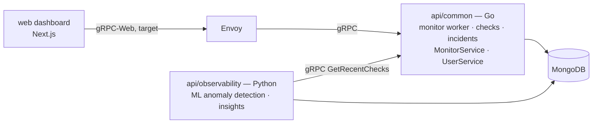

# Overview

Upstat is an open-source uptime and status monitoring platform. It schedules
health checks against services, records incidents, serves status pages, and
generates ML-powered reliability insights.

## Architecture

- **`web`** — Next.js dashboard and public status pages. Currently serves
  dashboard data from its in-app mock CRUD server (`/api/mock/v1`); talking
  to the backend over **gRPC-Web** is the target control plane (client
  retained, not yet wired).
- **Envoy** — front proxy at [deploy/helm/envoy/envoy.yaml](https://github.com/cuesoftinc/upstat/blob/main/deploy/helm/envoy/envoy.yaml).
  Translates browser gRPC-Web into native gRPC for the Go backend and applies
  CORS — part of the target control plane, not yet in the web app's live
  data path.
- **`api/common`** — Go gRPC backend: `MonitorService` and `UserService`, the
  internal monitor worker that schedules periodic checks, and persistence of
  monitors, check results, and incidents.
- **`api/observability`** — Python (FastAPI + gRPC) service: a gRPC client of
  the Go backend that pulls recent checks, runs anomaly detection and insight
  generation, and persists insights.
- **Data** — MongoDB stores monitors, check results, incidents, and insights.
- **Auth** — Google sign-in (`GOOGLE_CLIENT_ID`) plus JWTs issued by the Go
  backend; services authenticate to each other with a gRPC auth token.

The key architectural boundary: the Go backend owns operational monitoring
(scheduling, checks, state), and the observability service owns analytics and
machine learning, consuming the backend through a clear gRPC interface.

See [setup.md](setup.md) to run the stack locally, [architecture.md](architecture.md)
for detailed data flows, and the
[repository structure](https://github.com/cuesoftinc/upstat#repository-structure) in the README.

## Product & design documentation
> Published site: **https://cuesoft.gitbook.io/upstat** (Git-synced from this folder on every merge to main).

- [prd.md](prd.md) — product requirements breakdown (triple mandate: monitoring, analytics, ecosystem tracking)
- [architecture.md](architecture.md) — current system + PRD-phase target design (events layer, alerting)
- [data-model.md](data-model.md) — current + target entities, retention & privacy defaults
- [api.md](api.md) — gRPC surface map + the /v1/events ecosystem contract ("D2")
- [roadmap.md](roadmap.md) — phased plan; Phase 1 unblocks apparule/expendit analytics
- [design.md](design.md) + [pages.md](pages.md) — design language, pillars, microinteractions
- [query-grammar.md](query-grammar.md) — the shared query grammar behind explorers, widgets, monitors
- [decisions.md](decisions.md) — the open-decision register: ratify to unblock phases
- [deployment.md](deployment.md) — Cloud Run + App Hosting contract (cuesoft-iac provisioning, CI/CD pattern)
- flows/ — feature flow specs with edge cases: [auth](flows/auth.md), [monitor](flows/monitor.md), [alert](flows/alert.md)
- [analytics-math.md](analytics-math.md) — visitor hashing, sessionization, rollups, uniques honesty rules
- [engineering.md](engineering.md) — error catalog, authz matrix, rate limits, testing strategy, logging rules
- [features.md](features.md) — granular build backlog (stable unit IDs per phase)
